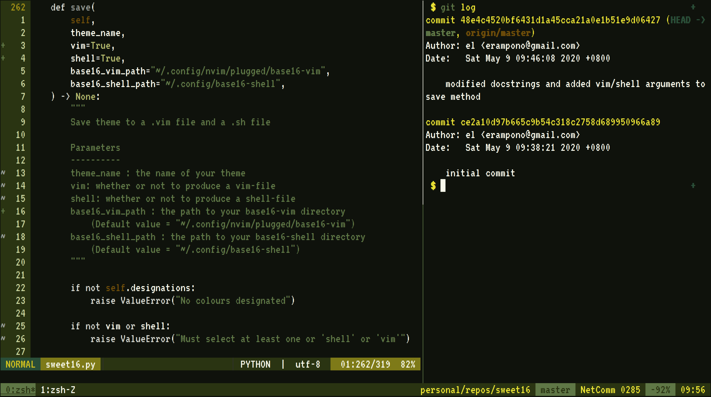
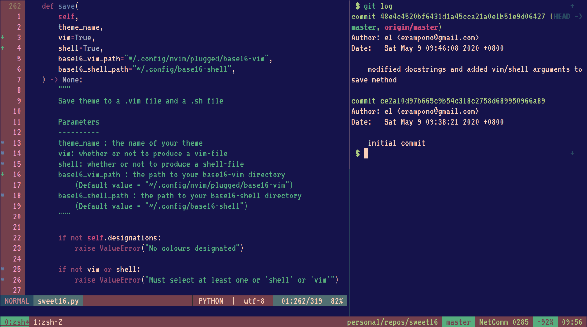
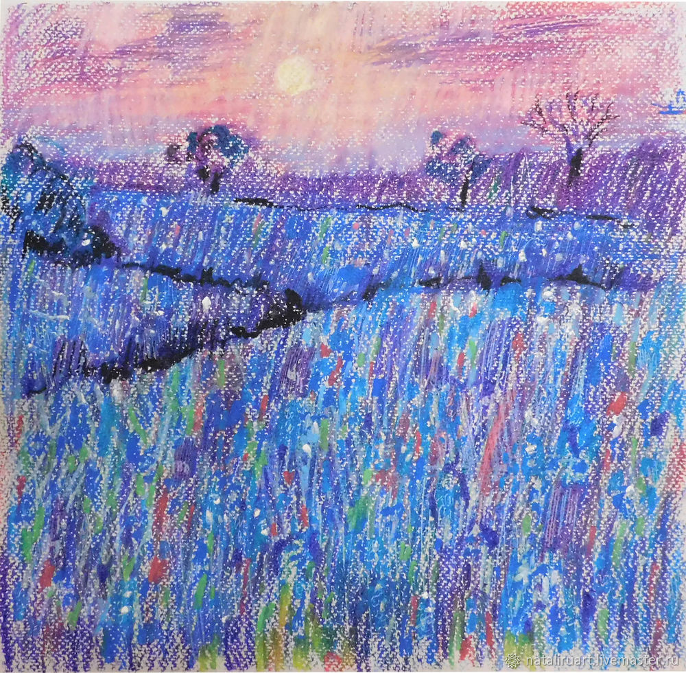

<h1> Themerator </h1>
A Base16 Theme-Generator for Shell and Vim <br>
Generates .vim and .sh files and saves them to configurable destinations.

This is not very functional right now and a work-in-progress. Can only currently be used in a python environment (Python > 3.6).

<h1> Usage </h1>


```
$ ipython
>>> from themerator import Theme
>>> theme = theme({path to image})
>>> theme.render() # previews the theme
>>> theme.save(theme name)
>>> exit()
$ source ~/.zshrc
$ base16_{theme name}
```

<h1> Examples </h1>
<h2> Before </h2>

Here is how your terminal might look *before* the magic happens


<h2> After </h2>

Here are some example images and their corresponding themes

<p align="center">
     <br>
     <br>
     <br>
     <br>
</p>

<h1> Relevant Projects </h1>

<list>
    <a href="https://github.com/chriskempson/base16">Base16</a> <br>
    <a href="https://github.com/fengsp/color-thief-py">Color-Thief-Python</a>
</list>
